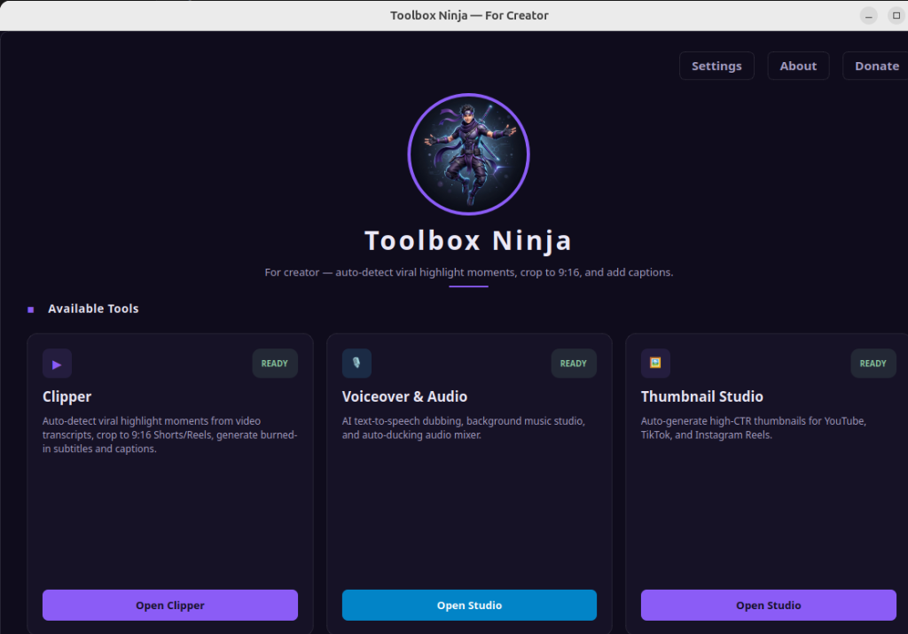
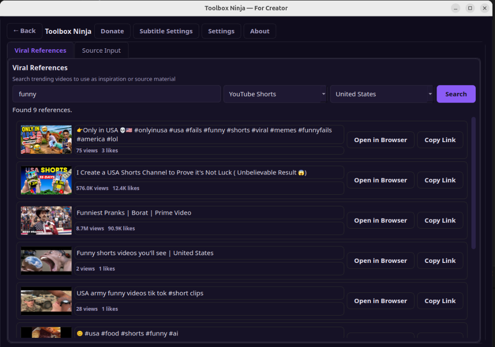
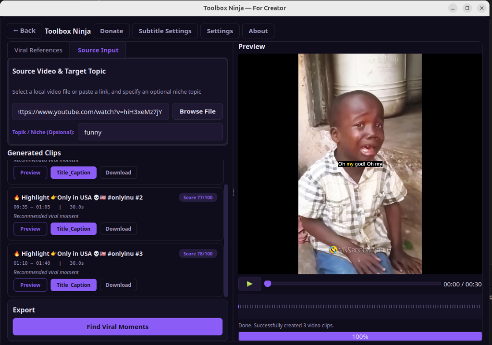
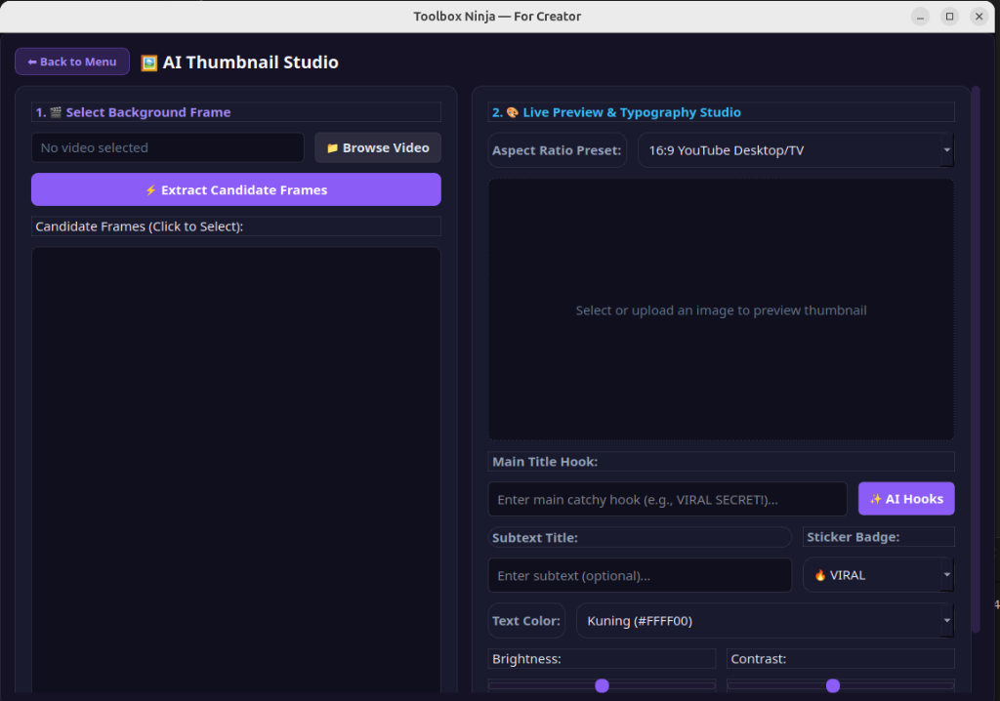
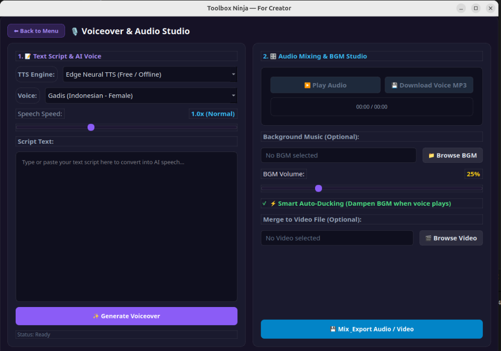

# 🥷 Toolbox Ninja — For Creator

> **All-in-One AI Media & Content Creation Suite** (Clipper AI, Voiceover & Audio Studio, AI Thumbnail Studio).

---

## 🌐 Language / Bahasa
- [English Documentation](#-english-documentation)
- [Dokumentasi Bahasa Indonesia](#-dokumentasi-bahasa-indonesia)

---

# 🇬🇧 English Documentation

## ⚡ Key Features

1. **🎬 Clipper AI (Viral Moment Detector)**:
   - Auto-detect high CTR highlight moments from long videos (YouTube or local `.mp4`/`.mkv`/`.mov`).
   - Crop to vertical format (9:16 Shorts/Reels/TikTok), 1:1, or 16:9 original ratio.
   - Generate burned-in animated subtitles and social media captions with speech-to-text (OpenAI Whisper).
   - Search trending viral references directly inside the app for content inspiration.

2. **🎙️ Voiceover & Audio Studio**:
   - Free multi-language Text-to-Speech (TTS) using **Microsoft Edge Neural Voices** (400+ voices, zero API key) or OpenAI TTS.
   - Speech speed controls (0.5x to 2.0x).
   - Background music (BGM) mixing with **Smart Auto-Ducking** (music automatically dampens while voice is playing).
   - Instant audio preview, export to `.mp3`, and direct video audio replacement.

3. **🖼️ AI Thumbnail Studio**:
   - Auto-extract key candidate frames from videos using OpenCV.
   - **AI Hook Title Generator** to create viral, high-CTR hook phrases.
   - High-contrast typography with drop shadows, outlines, background pills, and sticker badges (*"🔥 VIRAL"*, *"😱 UNBELIEVABLE"*, *"💡 MUST WATCH"*).
   - Aspect ratio presets: **16:9 YouTube**, **9:16 Shorts/Reels**, **1:1 Square Feed**.
   - Image enhancement filters (Brightness, Contrast, Saturation, Sharpness).

---

## 📸 Screenshots & Workflow

### 1. Main Dashboard


### 2. Search Viral References


### 3. Clipper AI — Auto Viral Moment Detector & Subtitles


### 4. Voiceover & Audio Studio (TTS & Auto-Ducking)


### 5. AI Thumbnail Studio (High-CTR Covers)


---

## 📦 Installation Guide

### 🐧 Linux & macOS (Automated 1-Click Script)
Open terminal in the project directory and run:
```bash
./setup.sh
```
*`setup.sh` automatically installs Python 3, FFmpeg, Ollama, downloads `gemma2:2b`, and creates a Desktop/App Launcher icon.*

### 🪟 Windows (Automated Batch Setup)
Double-click **`setup.bat`**. It uses Windows Package Manager (`winget`) to install Python 3.11, FFmpeg, Ollama, and creates a **Clipper AI Desktop** shortcut on your Desktop.

---

## 🚀 How to Run

- **Via Desktop Shortcut**: Double-click the **Toolbox Ninja** icon on your Desktop or App Launcher.
- **Via Terminal / Command Prompt**:
  - Linux/macOS: `./run.sh`
  - Windows: `run.bat`

---

## ⚙️ AI Provider Setup (Ollama & 9router)

1. **🦙 Ollama (Local & Free AI)**:
   - Install from [ollama.com](https://ollama.com).
   - Run `ollama pull gemma2:2b`.
   - In Settings: Select **Ollama**, Base URL `http://localhost:11434`, Model `gemma2:2b`.
2. **🌐 9router / OpenRouter (Cloud AI)**:
   - Get API key from [openrouter.ai](https://openrouter.ai).
   - In Settings: Select **9router / OpenRouter**, API Key `sk-or-v1-...`, Model `meta-llama/llama-3.1-8b-instruct:free`.

---
---

# 🇮🇩 Dokumentasi Bahasa Indonesia

## ⚡ Fitur Utama

1. **🎬 Clipper AI (Pendeteksi Momen Viral)**:
   - Mencari momen puncak berpotensi viral secara otomatis dari video panjang.
   - Mengubah ukuran video ke format vertikal (9:16 TikTok/Shorts/Reels), 1:1, atau 16:9.
   - Membuat subtitel otomatis *(burned-in subtitles)* dengan animasi kata demi kata (Whisper Speech-to-Text).
   - Fitur pencarian video acuan viral untuk ide konten langsung di dalam aplikasi.

2. **🎙️ Voiceover & Audio Studio**:
   - Text-to-Speech (TTS) gratis multi-bahasa dengan **Microsoft Edge Neural Voices** (400+ pilihan suara, tanpa API key) atau OpenAI TTS.
   - Pengatur kecepatan bicara (0.5x hingga 2.0x).
   - Penggabungan musik latar (BGM) dengan fitur **Smart Auto-Ducking** (volume musik mengecil otomatis saat vokal terdengar).
   - Unduh file `.mp3` dan gabungkan langsung ke file video.

3. **🖼️ AI Thumbnail Studio**:
   - Ekstraksi kandidat bingkai terbaik dari video secara otomatis.
   - **AI Hook Title Generator** untuk membuat judul umpan klik *(high-CTR hooks)* otomatis.
   - Tipografi tebal tinggi kontras dengan outline, bayangan, dan stiker badge (*"🔥 VIRAL"*, *"😱 UNBELIEVABLE"*, *"💡 MUST WATCH"*).
   - Preset aspek rasio: **16:9 YouTube**, **9:16 Shorts/Reels**, dan **1:1 Feed**.
   - Filter koreksi warna (Kecerahan, Kontras, Ketajaman).

---

## 📸 Tangkapan Layar & Alur Kerja

### 1. Halaman Utama (Main Dashboard)


### 2. Cari Video Acuan Viral (Viral References)


### 3. Clipper AI — Otomatis Deteksi Momen Viral & Subtitel


### 4. Voiceover & Audio Studio (TTS & Auto-Ducking)


### 5. AI Thumbnail Studio (Cover High-CTR)


---

## 📦 Panduan Instalasi

### 🐧 Linux & macOS (Script Otomatis 1-Klik)
Buka terminal di folder project dan jalankan:
```bash
./setup.sh
```
*Script `setup.sh` otomatis menginstall Python 3, FFmpeg, Ollama, mengunduh model `gemma2:2b`, serta membuat ikon di Desktop / Menu Aplikasi.*

### 🪟 Windows (Setup Batch Otomatis)
Klik ganda file **`setup.bat`**. Script akan memasang Python 3.11, FFmpeg, dan Ollama via `winget`, serta membuat shortcut **Clipper AI Desktop** di Desktop Windows Anda.

---

## 🚀 Cara Menjalankan Aplikasi

- **Via Shortcut Desktop**: Klik ganda ikon **Toolbox Ninja** di Desktop atau Launcher Aplikasi.
- **Via Terminal / Command Prompt**:
  - Linux/macOS: `./run.sh`
  - Windows: `run.bat`

---

## ⚙️ Pengaturan Provider AI (Ollama & 9router)

1. **🦙 Ollama (AI Lokal & Gratis)**:
   - Unduh dari [ollama.com](https://ollama.com).
   - Jalankan `ollama pull gemma2:2b`.
   - Di Pengaturan: Pilih **Ollama**, Base URL `http://localhost:11434`, Model `gemma2:2b`.
2. **🌐 9router / OpenRouter (Cloud AI)**:
   - Dapatkan API Key di [openrouter.ai](https://openrouter.ai).
   - Di Pengaturan: Pilih **9router / OpenRouter**, API Key `sk-or-v1-...`, Model `meta-llama/llama-3.1-8b-instruct:free`.

---

## 📄 Lisensi & Kredit
Dikembangkan oleh **Andeztea Creative Code**.
